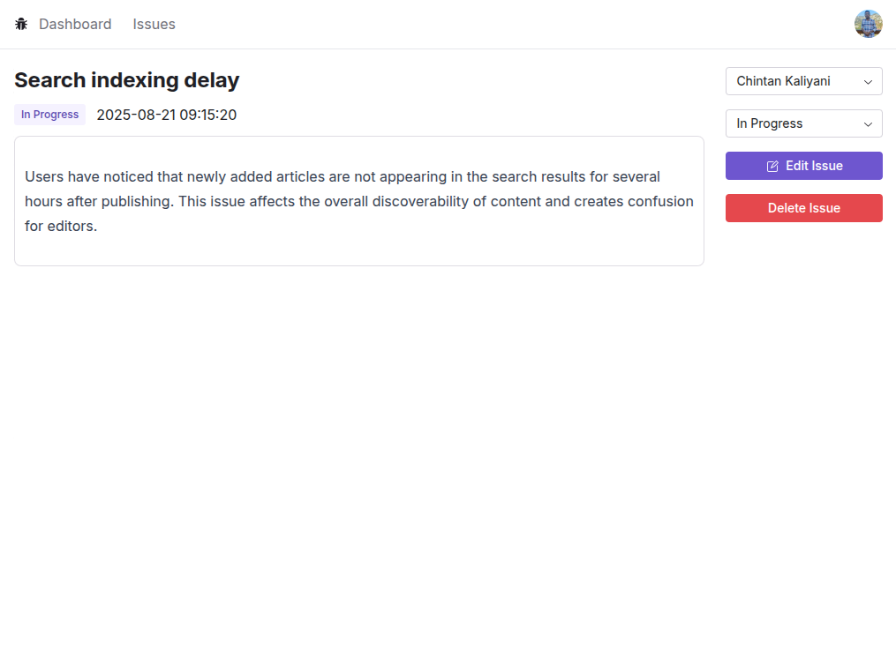

# 🐛 Issue Tracker

A full-stack **Issue Tracking System** built with **Next.js, Prisma, PostgreSQL, and NextAuth**.  
This project allows teams to manage issues effectively with features like authentication, issue assignment, filtering, and analytics.

---

## 🚀 Demo
Live deployment: [Issue Tracker on Vercel](https://issue-tracker-omega-one.vercel.app/)

---

## 🚀 Features

- **User Authentication**
  - Google login with NextAuth
- **Dashboard**
  - Summary of issues (by status)
  - Latest 5 issues
  - Bar chart visualization
- **Issue Management**
  - View list of all issues
  - Filter and sort issues
  - Create, edit, and delete issues
- **Assignments & Status**
  - Assign issues to users
  - Change issue status (Open, In Progress, Closed)
- **Modern UI**
  - Built with React + Radix UI components

---

## 🛠️ Tech Stack

- **Frontend**: Next.js (App Router)
- **UI**: Radix UI + TailwindCSS
- **Database**: PostgreSQL
- **ORM**: Prisma
- **Auth**: NextAuth.js (Google Provider)
- **Charts**: Recharts
- **Hosting**: Vercel

---

## ⚙️ Setup Instructions

### 1. Clone the repository
```bash
git clone https://github.com/chintank1911/issue-tracker.git
cd issue-tracker
```

### 2. Install dependencies
```bash
npm install
```

### 3. Setup Environment Variables
Create a `.env` file in the root:

```env
DATABASE_URL="your-database-url"
NEXTAUTH_URL="http://localhost:3000"
NEXTAUTH_SECRET="your-secret"

# Google Auth
GOOGLE_CLIENT_ID="your-google-client-id"
GOOGLE_CLIENT_SECRET="your-google-client-secret"
```

### 4. Run Prisma migrations
```bash
npx prisma migrate dev
```

### 5. Start the app
```bash
npm run dev
```

---

## 📊 Dashboard Preview

- Issues summary by status  
- Latest 5 issues table  
- Issues bar chart visualization  


---

## 📝 Issue List Preview

- View all issues in a tabular format  
- Apply filters to narrow down issues  
- Sort issues by different fields


---

## 👀 View Issue Preview  

- Detailed view of a selected issue  
- Edit issue details (title, description)  
- Change status (e.g., Open, In Progress, Closed)  
- Assign issue to a specific user  
- Delete issue with confirmation modal 


